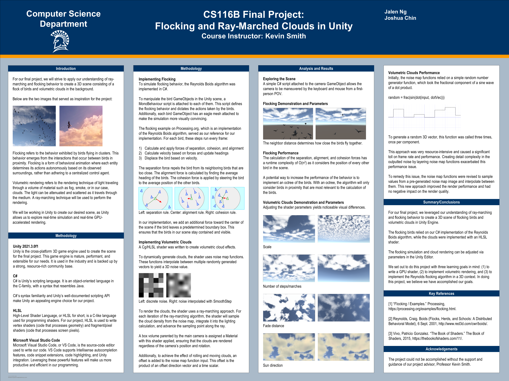

# Flocking and Clouds in Unity
SJSU CS 116B Spring 2022 Final Project

This repository contains the source code for a simulation of birds flocking among ray-marched clouds in Unity.
 
## Video demonstration
Click [here](https://photos.google.com/share/AF1QipMGeIiE-aFXBIDwvFpjpZJERs4jp76BgOE4OPcS0YvfI2UgBkBU-GOA7tc4LDcIYg/photo/AF1QipMyjpZKFJz_VBTY49t3vCdE9SqrxmYZhRvdz4qz?key=R1FPa0QtRzBkdk1TX1RnN3ZEZHhjbGVQQkdaMzhR) to watch the video demonstration (5:43).

## Poster board
